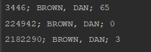
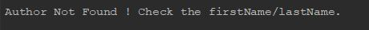
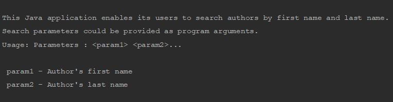

# Author Search
**Stepstone assignment:**
-

**Description:**

For given public REST API from Penguin Random House for author search and possible search opportunities (search by firstName and lastName),
list all authors with their unique ids in system, names and number of titles. In case author took contribution is other written resource,
REST API would return more author objects with same author name and different ids. List all author ids with corresponding number of titles.

**Useful Information:**

A Java application which enables its users to search authors by first name and last name. Search parameters could be provided as program arguments.
REST API for author search is http://www.penguinrandomhouse.biz/webservices/rest/#authors, parameter names for search are firstName and lastName correspondingly for author's first name and last name.

**Example:**

For input parameters: firstName = Dan and  lastName= Brown, application would print:

 - 3446; BROWN, DAN; 68
 - 224942; BROWN, DAN; 0
 - 2182290; BROWN, DAN; 3
 
 **What has been done:**
 
 I developed a maven application, you run it via console or you can execute the generated JAR file. I tried to handle all the posiible exceptions and I provided the JUnit tests.
 Repository architecture :
 
  - ./application doc : you find in this directory the javadoc of this application
  - ./out/artifacts/authorsearch_jar/authorsearch.jar : the JAR file of the application
  - ./src/main : source code
  - ./src/test : the junit tests are provided here
 
 **How to run the application:**
 
 To run this application, follow the next steps:
 
  - open the terminal
  - git clone https://github.com/BOUZAABIAM/authorsearch.git
  - cd authorsearch
  - cd out/artifacts/authorsearch_jar
  - java -jar authorsearch.jar <AUTOHR_FIRST_NAME> <AUTHOR_LAST_NAME>
  
  Examples :
  
   * java -jar authorsearch.jar Dan Brown
    
   
   
   * java -jar authorsearch.jar dis fersg
    
   
    
   * java -jar authorsearch.jar Dan
    
   

    
    
